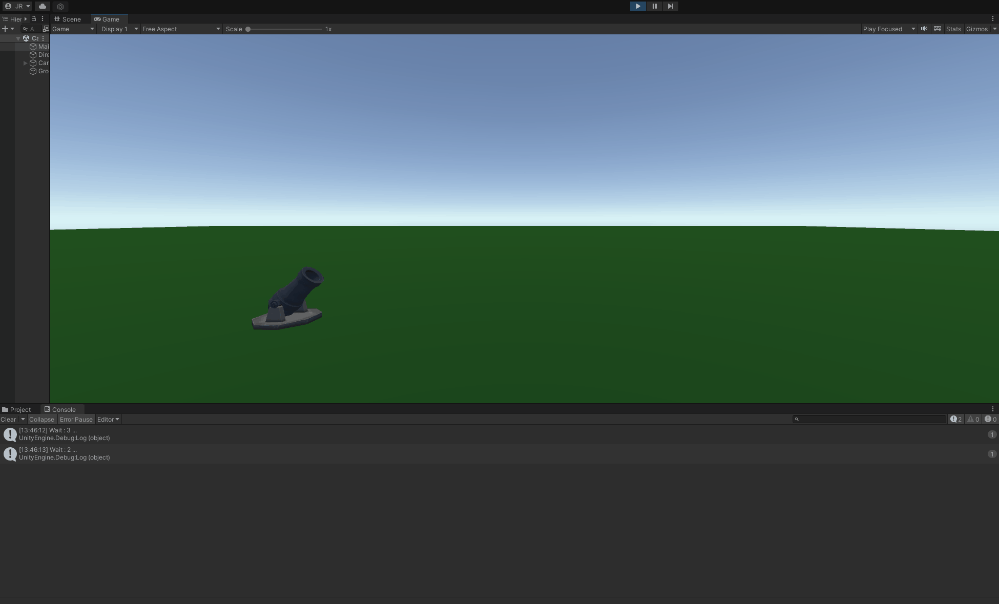

  
    
        
  

  

       CoderHouse - VideoGames With Unity
  

# CH-timedShots
escena de Unity donde se realliza cambio de escala 

> Consigna: Se deberá realizar una escena de Unity donde:
* Un objeto que instancie balas cada cierto tiempo (valor que se pueda cambiar por inspector).
* Dichas balas deben destruirse automáticamente tras cierto tiempo (ajustable por inspector).
* Si pulsamos la barra espaciadora, las balas deben duplicar su escala actual.

>Aspectos a incluir en el entregable:
Entregar el proyecto completo, con los scripts listos y la escena funcionando.

  
    
        
  

  

       DEMO
  

